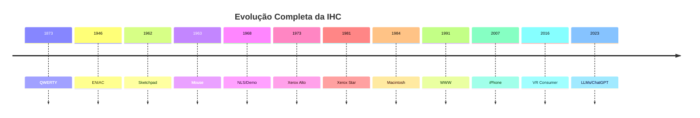

# 📜 **História Completa da Interação Humano-Computador (IHC): Dos Primórdios à Era Moderna**

## **🌍 Contexto Histórico e Evolução Tecnológica**

### **1️⃣ Pré-IHC (Século XIX - 1940s)**
#### **1873: Teclado QWERTY**
- **Origem:** Criado por Christopher Sholes para máquinas de escrever Remington
- **Objetivo:** Layout projetado para reduzir velocidade de datilografia e evitar travamento mecânico
- **Curiosidade:** O arranjo "QWERTY" foi mantido por convenção, apesar de layouts alternativos (como Dvorak) serem mais eficientes
- **Impacto:** Padrão ainda dominante após 150 anos, mostrando como convenções podem persistir

### **2️⃣ Primeira Geração de Computadores (1940s-1950s)**
#### **1946: ENIAC**
- **Características:**
  - 30 toneladas, 180m² de área
  - Programação via cabos e switches
- **Métodos de Interação:**
  - Cartões perfurados como entrada de dados
  - Painéis de configuração complexos
- **Limitação:** Exclusivo para engenheiros e matemáticos

## **💡 Revolução Conceitual (1960s-1970s)**

### **3️⃣ Inovações Pioneiras**
#### **1962: Sketchpad (Ivan Sutherland)**
- **Revoluções:**
  - Primeiro sistema CAD com interface gráfica
  - Introdução de conceitos fundamentais:
    - Manipulação direta de objetos
    - Zoom e transformações em tempo real
    - Constraints geométricos
- **Legado:** Base para todas as interfaces gráficas modernas

#### **1963: Mouse (Doug Engelbart)**
- **Desenvolvimento:**
  - Protótipo de madeira com dois discos metálicos
  - Patente descrevendo "indicador de posição X-Y para sistema de display"
- **Estudo Comparativo (1967):**
  - Mouse: 2.3 segundos por tarefa
  - Light Pen: 2.8 segundos
  - Joystick: 4.9 segundos
- **Importância:** Demonstrou superioridade para seleção precisa

#### **1968: "A Mãe de Todas as Demos"**
- **Apresentação histórica mostrando:**
  - Videoconferência
  - Edição colaborativa
  - Hipermídia
- **Sistemas inovadores:**
  - NLS (oN-Line System)
  - Primeiro editor de texto com comandos estruturados

## **🖥️ Popularização das Interfaces (1970s-1980s)**

### **4️⃣ Interfaces Gráficas Comerciais**
#### **1975: Pygmalion (David Smith)**
- **Inovações:**
  - Primeiro uso sistemático de ícones
  - Conceito de "programação por demonstração"
  - Metáfora de desktop virtual

#### **1981: Xerox Star (Xerox PARC)**
- **Componentes revolucionários:**
  - WYSIWYG completo
  - Sistema de janelas sobrepostas
  - Lixeira como metáfora de deleção
  - Barra de status contextual
- **Problemas:**
  - Preço proibitivo (US$15k + US$8k/estação)
  - Público-alvo corporativo restrito

#### **1984: Apple Macintosh**
- **Diferencias:**
  - Preço acessível (US$2.5k)
  - Interface consistente em ROM
  - Kit de desenvolvimento para terceiros
- **Componentes-chave:**
  - Finder como shell gráfico
  - Menu bar fixo
  - Controle preciso com mouse de 400dpi

## **🌐 Era da Conectividade (1990s-2000s)**

### **5️⃣ A Revolução da Web**
#### **1991: World Wide Web (Tim Berners-Lee)**
- **Princípios fundamentais:**
  - URLs como identificadores universais
  - HTTP como protocolo de transferência
  - HTML como linguagem de marcação
- **Primeiro navegador:** Também funcionava como editor

#### **Pesquisas Seminais (1990s)**
- **Ergonomia Cognitiva:**
  - Lei de Fitts aplicada a menus
  - Hierarquias de informação
  - Affordances visuais
- **Hipermídia:**
  - Navegação não-linear
  - Efeitos de desorientação

## **🤖 Era da Interação Natural (2010s-Presente)**

### **6️⃣ Novos Paradigmas**
#### **Interação por Gestos**
- **Evolução:**
  - Palm Graffiti (1995)
  - Microsoft Surface (2007)
  - Leap Motion (2013)
- **Princípios:**
  - Vocabulário gestual limitado
  - Feedback multimodal

#### **Realidade Virtual/Aumentada**
- **Marcos:**
  - Oculus Rift (2016)
  - HoloLens (2016)
  - Dexmo Exoskeleton (feedback háptico)
- **Desafios:**
  - Motion sickness
  - Fadiga visual

## **🔮 Futuro e Tendências**

### **7️⃣ Novas Fronteiras**
- **Interfaces Cerebrais:**
  - BCIs não-invasivas (ex: EEG)
  - Aplicações médicas
- **Computação Afetiva:**
  - Reconhecimento de emoções
  - Adaptação contextual
- **Desafios Éticos:**
  - Privacidade de dados biométricos
  - Viés algorítmico

## **📊 Linha do Tempo Expandida**

> 💡 **Padrão Histórico:** Inovações levam ~20 anos da pesquisa ao mercado (ex: mouse 1963 → popularização 1984)